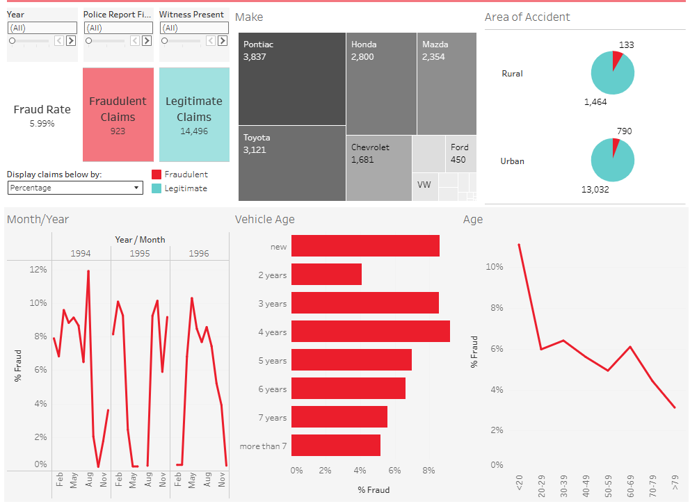
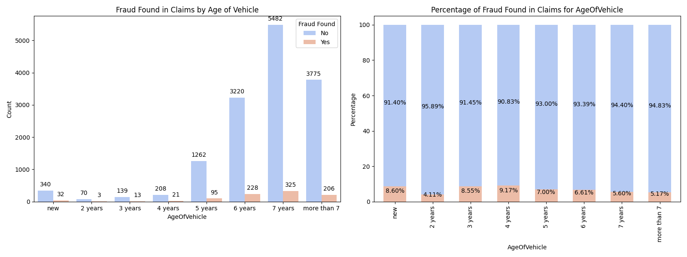
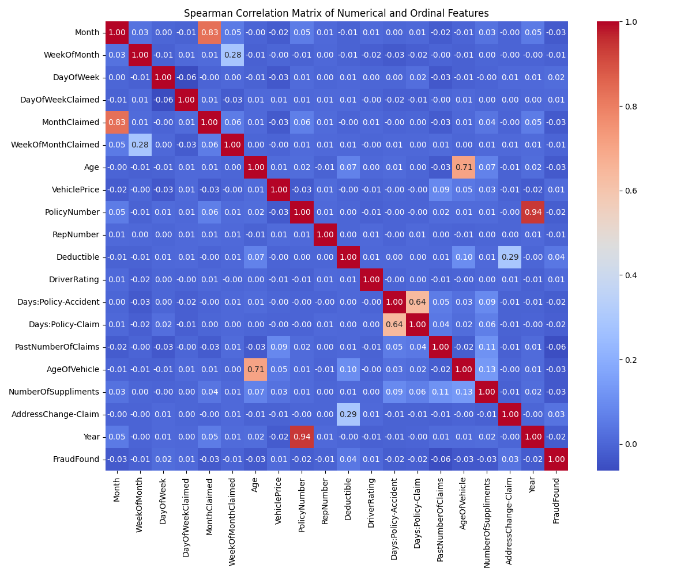
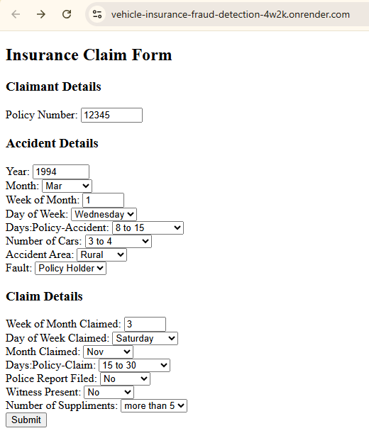
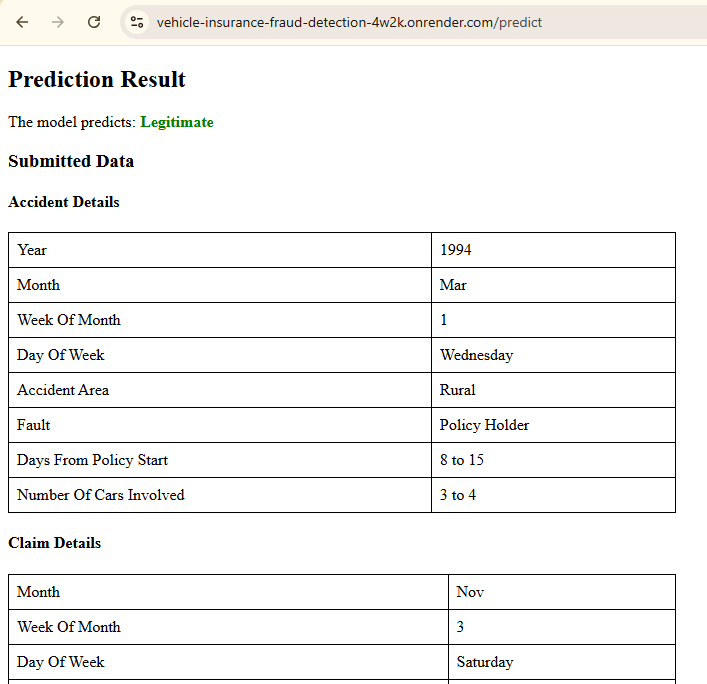

# Vehicle Insurance Fraud Detection: Project Overview 
This project predicts whether vehicle insurance claims are fraudulent or legitimate using the OSEMN framework and various machine learning models.
- Evaluated performance of different ML algorithms (Random Forest and XGBoost) and balancing techniques (SMOTE and class weight adjustment).
- Identified important variables and underlying patterns in fraud detection via feature selection.
- Deployed the best model using the Flask module to create a web application for real-time predictions.

## Code and Resources Used 
**Python Version:** 3.11.9  
**Packages:** pandas, numpy, matplotlib, seaborn, tabulate, scikit-learn, xgboost, imblearn, flask
**For Package Requirements:**  ```%pip install -r requirements.txt```  
**Data Set Source:** https://www.kaggle.com/datasets/khusheekapoor/vehicle-insurance-fraud-detection

## Obtain (O)

The dataset used in this project was obtained from Kaggle and provided by Angoss Knowledge Seeker. 

Dataset properties:
- 15420 samples from 1994 to 1996 (14497 legitimate, 923 fraudulent)
- 33 features (8 numeric, 25 categorical)
- Includes  driver personal information, insurance claims data, and vehicle details

## Scrub (S)

The data was cleaned to ensure it was error-free and ready for analysis. The following changes were made:

*	Randomly imputed `age` value of 16 or 17 where `age` = 0 and `Age Policy = 16-17`
*   Drop row where `DayOfWeekClaimed` and `MonthClaimed = 0`


## Explore (E)
An overview dashboard was also published on [Tableau](https://public.tableau.com/views/VehicleInsuranceClaims_17428952593430/VehicleInsuranceClaimsDashboard?:language=en-GB&:sid=&:redirect=auth&:display_count=n&:origin=viz_share_link) to enable a high-level exploration of the claim data.

[](https://public.tableau.com/views/VehicleInsuranceClaims_17428952593430/VehicleInsuranceClaimsDashboard?:language=en-GB&:sid=&:redirect=auth&:display_count=n&:origin=viz_share_link)

Key highlights from the EDA:




## Model (M)

The modeling process involved:
1. One-hot Encoding: Transforming categorical variables into dummy variables 
2. Data Split: 80% train, 20% test
3. Balancing Technique: SMOTE and/or Weight Adjustment
4. Training: 5-fold cross validation + Hyperparameter tuning (Random Search)
5. Evaluation

The use of AUCPR as the scoring metric during hyperparameter tuning and balancing techniques and were applied to address the class imbalance issue. 

## Interpret (N)

### Test Performance using CV-selected Threshold based on Max-F1

| Model                        | Best Threshold | Accuracy | Precision | Recall  | F1-score |
|------------------------------|---------------|----------|-----------|---------|---------|
| Random Forest               | 0.1514        | 0.8901   | 0.2635    | 0.3920  | 0.3152  |
| Random Forest SMOTE         | 0.6216        | 0.9358   | 1.0000    | 0.0050  | 0.0100  |
| Random Forest Weighted      | 0.5593        | 0.8781   | 0.2040    | 0.3065  | 0.2450  |
| RF SMOTE + Weighted         | 0.9516        | 0.9361   | 0.7500    | 0.0151  | 0.0296  |
| XGBoost                     | 0.5022        | 0.9556   | 0.6360    | 0.7286  | 0.6792  |
| XGBoost SMOTE               | 0.4156        | 0.9439   | 0.5580    | 0.6281  | 0.5910  |
| XGBoost Weighted            | 0.5022        | 0.9556   | 0.6360    | 0.7286  | 0.6792  |
| XGBoost SMOTE + Weighted    | 0.4156        | 0.9439   | 0.5580    | 0.6281  | 0.5910  |

XGBoost models outperformed the Random Forest models.

Balancing techniques did not improve the F1-score of XGBoost models. Therefore, the XGBoost model trained without balancing techniques was selected as the best model. Additionally, this model did not benefit significantly from adjusting the threshold based on CV predictions. As a result, the threshold was maintained at 0.5.

### Feature Importance

The following table displays the 10 most important features based on the model's feature importance, rounded to 3 decimal places.

| Rank | Variable                          | Importance |
|------|-----------------------------------|------------|
| 120  | BasePolicy_Liability              | 0.107      |
| 67   | PolicyType_Sedan - Liability      | 0.105      |
| 65   | Fault_Third Party                 | 0.092      |
| 111  | AddressChange-Claim_2 to 3 years  | 0.034      |
| 11   | Month_Jan                          | 0.027      |
| 113  | AddressChange-Claim_no change     | 0.026      |
| 5    | Deductible                        | 0.025      |
| 66   | PolicyType_Sedan - Collision      | 0.017      |
| 53   | MonthClaimed_Jan                  | 0.016      |
| 51   | MonthClaimed_Dec                  | 0.014      |

The important features identified in this project are in agreement with [Benedek & László (2019)](https://doi.org/10.2478/subboec-2019-0009), who identified Policy Type, Fault and Vehicle Category as key fraud indicators in the same dataset.


### Deployment

A Flask web application was built to process user input and return predictions via a web interface. The application can be hosted locally by running [app.py](app.py), and it serves HTML pages with results. Additionally, it was also deployed as a web service via [Render](https://vehicle-insurance-fraud-detection-4w2k.onrender.com/).
Note: As the web service is run via Render's free instance, requests may be delayed by 50 seconds or more.
[](https://vehicle-insurance-fraud-detection-4w2k.onrender.com/)
[](https://vehicle-insurance-fraud-detection-4w2k.onrender.com/)

## Conclusion

This project aimed to identify fraudulent vehicle insurance claims using machine learning. After evaluating different approaches, XGboost was selected for its balance of precision and recall, ensuring both accuracy and reliability.

Key takeaways:
- Feature Importance: Policy type, vehicle type, and fault assignment emerged as strong predictors of fraud.
- Future Improvements: Integrating recent data sources and adding more features to improve model relevance and prediction strength.

## Project Organization

```
├── README.md          <- Project Overview
├── data
│   ├── interim        <- Intermediate data that has been transformed
│   ├── processed      <- The final, canonical data sets for modeling
│   └── raw            <- The original, immutable data dump
│
├── models             <- Trained and serialized models, model predictions, or model summaries
│
├── notebooks          <- Jupyter notebooks. Naming convention is a number (for ordering),
│                         and a short `-` delimited description, e.g.
│                         `1.0-jqp-initial-data-exploration`
│
├── references         <- Data dictionaries, manuals, and all other explanatory materials
│
├── reports            <- Generated analysis and results as HTML, PDF, LaTeX, CSV etc.
│   ├── figures        <- Generated graphics and figures from EDA
│   └── best-model     <- Generated model interpretation and fairness evaluation for the selected model
│
├── templates          <- Holds the HTML templates for the web interface where the model can be deployed
│
├── app.py             <- The main script that allows users to interact with the model via a web application
│
└──  requirements.txt  <- The requirements file for reproducing the analysis environment, 
                           e.g. generated with `pip freeze > requirements.txt`

```

--------